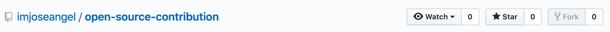
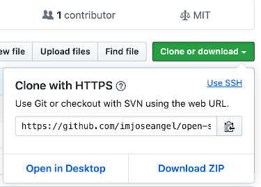
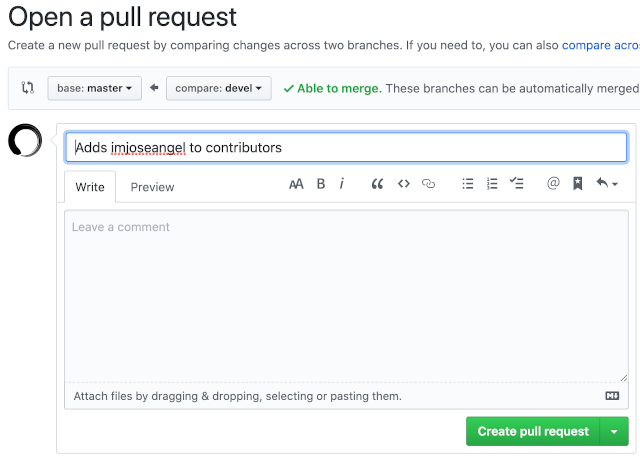

# Open-Source Contribution

## Learn how to contribute to open-source projects

You'll learn the git workflow required to contribute to open-source projects. ⚡

For git basics & tips & tricks - [click me](https://github.com/devlovers/open-source-contribution/blob/devel/gittipstricks.md)! 🖱️

👀 _Go to the end of the file to see who contributed!_ 👀

## WHAT ARE YOU GOING TO LEARN

- The git workflow required for working on open-source projects
- Working in a team

## WHAT ARE YOU NOT GOING TO LEARN

- How to use git
- How to code

## STEP 1 - FORK THIS REPOSITORY 🍴

Fork this repository by clicking on the fork button.

When you fork a repository, you simply create a copy the repo on your account.

## STEP 2 - CLONE THE REPO

The next step is to clone the repository to your machine, so you can make changes.

To do so, go into the repo you just forked into your account, then click the button called **Clone or download**.

Copy the link, and run this in your terminal:

`git clone <the-url-you-just-copied>`

In my case, it would be:

`git clone https://github.com/devlovers/open-source-contribution.git`

In your case, you would replace _devlovers_ with your username.

## STEP 3 - CREATE A BRANCH

First of all, open the repository in your editor.

Then, create a branch as follows:

`git checkout -b <enter-your-branch-name>`

An example would be:

`git checkout -b "Added_My_Name_To_README"`

The name of your branch should be short and descriptive. The branch above is just an example, but it can be called however you want.

It should describe the purpose of your changes though. I chose that name because I added my name to the README (_what you'll do as well_).

## STEP 4 - MAKE YOUR CHANGES

1. Open the file called `README.md`
2. Find the [CONTRIBUTORS](#CONTRIBUTORS-🧑‍🤝‍🧑) section.
3. Add your name **RANDOMLY** in the list to avoid merge conflicts

Once you have added your name and Twitter handle, run in your terminal:

1. `git add README.md` (it represents the file where you made the change)

2. `git commit -m "Added my name and twitter handle"` (this represent the message that explains what you did)

3. `git push origin <your-branch-name>` (push your changes to Github)

## STEP 5 - OPEN A PULL REQUEST (PR)

The purpose of a pull request is to show to other developers the changes you did.

Also, they review your code to make sure your code is optimal.

1. Once you pushed your changes to Github, go to the repo and click on `Compare & pull request`.

1. Add a descriptive title and description

1. Click on `Create pull request`.

2. Wait for me to merge your changes to the master change. They will become live once I merge them.

**Congratulations!** This is the required Git workflow to contribute to open source projects.

## EXTRA TIPS

Go over my repos, and if you see any typos & programming bugs/errors, open a PR.

## CONTRIBUTORS

Add your name and Twitter handle.

- imjoseangel => Twitter: [@imjoseangel](https://twitter.com/imjoseangel) 🐦
- oxctdev => Twitter: [@andridev_](https://twitter.com/andridev_) 
